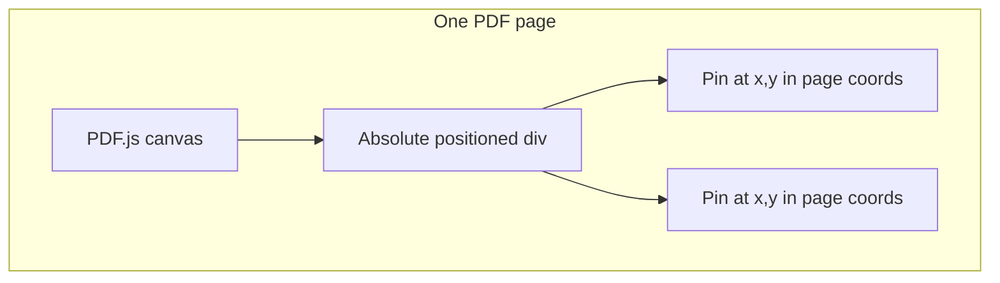

# Mini-project 1: PDF pin prototype

**Goal:** Load a PDF, show pins at document coordinates, and keep them aligned when the user zooms or scrolls.

**Suggested code location:** `mini-projects/01-pdf-pin-prototype/`

**Prerequisites:** JavaScript/TypeScript basics, React fundamentals. No backend required.

**Next project:** [02-ocr-debugger.md](./02-ocr-debugger.md)

---

## Chat starter

Copy into a **new Cursor chat**:

```
@docs/mini-projects/01-pdf-pin-prototype.md

Implement this mini-project in mini-projects/01-pdf-pin-prototype/.
Use Vite + React + TypeScript + pdfjs-dist. Follow the plan step by step.
Stop when the success criteria are met.
```

---

## What you'll learn

- How PDF.js renders pages
- Page space vs screen space (core of Pinpoint's UI)
- Overlaying HTML on top of a canvas

---

## Architecture



**Key idea:** PDF.js gives each page a **viewport** with a scale. Pin positions are stored in **unscaled page coordinates** (scale = 1). When zoom changes, multiply by the current scale.

---

## Setup

```bash
npm create vite@latest mini-projects/01-pdf-pin-prototype -- --template react-ts
cd mini-projects/01-pdf-pin-prototype
npm install pdfjs-dist
```

---

## Implementation steps

### 1. Render one PDF page

- Configure `pdfjs-dist` worker for Vite (`GlobalWorkerOptions.workerSrc`)
- Load a local sample PDF from `public/`
- Render page 1 to a `<canvas>` using `page.getViewport({ scale })` and `page.render()`

### 2. Define pin type

```ts
type Pin = {
  id: string;
  page: number;
  x: number;   // PDF user space, scale = 1
  y: number;
  label: string;
};
```

### 3. Overlay pins

- Wrap canvas + pins in `position: relative`
- Each pin: `position: absolute` at `left: pin.x * scale`, `top: pin.y * scale`
- Use `transform: translate(-50%, -100%)` so the pin tip points at the coordinate

### 4. Click to place a pin

- Listen for clicks on the overlay layer
- Convert screen → page coords: `{ x: clickX / scale, y: clickY / scale }`
- Append to pins state

### 5. Zoom controls

- Keep `scale` in React state (e.g. 0.75, 1.0, 1.25, 1.5, 2.0)
- On scale change: re-render canvas at new scale; pins use `pin.x * scale` (stored unscaled)

### 6. Multi-page (stretch)

- One page component per PDF page
- Filter pins by `pin.page`

---

## Pitfalls

| Problem | Fix |
|---------|-----|
| Pins drift on zoom | Store pins unscaled; multiply only at render time |
| PDF.js worker errors | Set `GlobalWorkerOptions.workerSrc` correctly for Vite |
| Blurry canvas on zoom | Re-render canvas at new scale; don't CSS-scale a low-res canvas |

---

## Stretch goals

- Click pin → show tooltip
- Load pins from a JSON file
- Toggle pin visibility

---

## Success criteria

- [ ] PDF loads and displays in the browser
- [ ] User can click to place a pin on the document
- [ ] Zoom 50%–200% keeps pins aligned with the same spot on the page
- [ ] Pins persist in React state across zoom changes

---

## Becomes in Pinpoint

Document viewer + pin overlay layer (production MVP UI).
