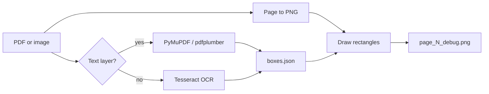

# Mini-project 2: OCR debugger

**Goal:** Input a PDF or image; output (1) JSON with text + bounding boxes and (2) a debug image with boxes drawn on it.

**Suggested code location:** `mini-projects/02-ocr-debugger/`

**Prerequisites:** Python basics. Project 1 not required, but helps you visualize where boxes should land.

**Previous:** [01-pdf-pin-prototype.md](./01-pdf-pin-prototype.md)  
**Next project:** [03-explanation-api.md](./03-explanation-api.md)

---

## Chat starter

Copy into a **new Cursor chat**:

```
@docs/mini-projects/02-ocr-debugger.md

Implement this mini-project in mini-projects/02-ocr-debugger/.
Python CLI: input PDF/image → output/boxes.json + output/page_N_debug.png.
Follow the plan step by step. Stop when the success criteria are met.
```

---

## What you'll learn

- Digital PDF vs scanned PDF
- Bounding box formats
- Why pin placement fails on real bank statements and tax forms

---

## Architecture



---

## Setup

```bash
mkdir -p mini-projects/02-ocr-debugger
cd mini-projects/02-ocr-debugger
python -m venv .venv
source .venv/bin/activate
pip install pymupdf pillow pytesseract pdfplumber
```

**macOS:** `brew install tesseract`

Add `samples/` with redacted test documents (do not commit real PII).

---

## Implementation steps

### 1. CLI entry point

```
python debug_doc.py <input_path> -o output/
```

- Detect PDF vs image by extension
- Create output directory

### 2. Digital PDF extraction (try first)

Use PyMuPDF `page.get_text("words")` → list of `(x0, y0, x1, y1, word, ...)`.

### 3. OCR path for images / scanned pages

Use `pytesseract.image_to_data()` with confidence threshold (e.g. skip `conf < 60`).

### 4. Render page to image for debugging

PyMuPDF `page.get_pixmap(matrix=zoom)` → PIL Image. Track `zoom` factor for drawing.

### 5. Draw boxes on image

PIL `ImageDraw.rectangle()` — lime for all words; red for matched jargon (optional).

### 6. Output JSON schema

```json
{
  "source": "statement.pdf",
  "pages": [
    {
      "page": 1,
      "width": 612,
      "height": 792,
      "words": [
        {
          "text": "APR",
          "bbox": { "x": 120.5, "y": 340.2, "width": 28.0, "height": 12.0 },
          "confidence": 95
        }
      ]
    }
  ]
}
```

### 7. Jargon highlight (preview of pin detection)

Match against a list: `apr`, `escrow`, `deductible`, `ytd`, `minimum payment`, etc. Optionally group adjacent words on the same line into phrases.

---

## Test documents

Use 3–5 redacted files:

- Digital PDF bank statement (text selectable)
- Scanned PDF or photo of a bill
- Multi-column credit card statement
- Dense tax form

---

## Success criteria

- [ ] `python debug_doc.py sample.pdf -o output/` produces `boxes.json`
- [ ] Debug PNG shows boxes aligned with visible words
- [ ] Scanned and digital PDF paths both work (or document which path failed)
- [ ] JSON schema is stable enough for project 4 to consume

---

## Becomes in Pinpoint

Ingestion worker / OCR service — the pipeline that feeds pin coordinates.
