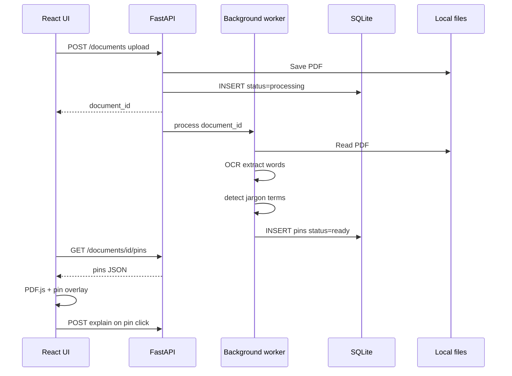

# Mini-project 4: Pipeline glue

**Goal:** Wire projects 1–3 into one minimal end-to-end flow: upload → process → auto pins → UI displays pins → click for explanation.

**Suggested code location:** `mini-projects/04-pipeline-glue/`

**Prerequisites:** Complete [01](./01-pdf-pin-prototype.md), [02](./02-ocr-debugger.md), and [03](./03-explanation-api.md) (or port their code into this project).

---

## Chat starter

Copy into a **new Cursor chat**:

```
@docs/mini-projects/04-pipeline-glue.md

Implement this mini-project in mini-projects/04-pipeline-glue/.
FastAPI backend + React frontend. Reuse patterns from mini-projects 01-03.
Follow the plan step by step. Stop when the success criteria are met.
```

---

## What you'll learn

- Async document processing
- Minimal data model (SQLite)
- End-to-end product flow before production infra

---

## Stack (minimal)

| Piece | Choice |
|-------|--------|
| Frontend | React + PDF.js (from project 1) |
| API | FastAPI (Python) |
| DB | SQLite |
| Queue | `BackgroundTasks` or thread (Redis later) |
| Files | Local `data/uploads/` (S3 later) |

---

## Architecture



---

## Data model (SQLite)

```sql
CREATE TABLE documents (
  id TEXT PRIMARY KEY,
  filename TEXT,
  status TEXT,  -- processing | ready | failed
  storage_path TEXT,
  created_at TEXT
);

CREATE TABLE pins (
  id TEXT PRIMARY KEY,
  document_id TEXT,
  page INTEGER,
  text TEXT,
  bbox_json TEXT,
  x REAL,
  y REAL,
  is_visible INTEGER DEFAULT 1,
  explanation TEXT,
  FOREIGN KEY (document_id) REFERENCES documents(id)
);
```

---

## API endpoints

```
POST   /documents              multipart upload → { id, status }
GET    /documents              list
GET    /documents/{id}         metadata + status
GET    /documents/{id}/pins    pin array when ready
GET    /documents/{id}/file    serve PDF for PDF.js
POST   /documents/{id}/pins/{pin_id}/explain   on-demand explanation
```

---

## Implementation steps

### 1. Backend scaffold

- FastAPI app, CORS for Vite dev server
- SQLite init on startup
- `data/uploads/` for PDF storage

### 2. Upload + background processing

```python
@app.post("/documents")
async def upload(file: UploadFile, background_tasks: BackgroundTasks):
    doc_id = save_file(file)
    background_tasks.add_task(process_document, doc_id)
    return {"id": doc_id, "status": "processing"}
```

### 3. Worker: `process_document(doc_id)`

Port from project 2:

1. Extract words + bboxes
2. Detect jargon (dictionary match v1)
3. Compute pin anchor: center-top of bbox
4. Insert pins into SQLite
5. Set `status = ready` (or `failed` on error)

### 4. Term detection (v1)

```python
JARGON = ["apr", "escrow", "deductible", "minimum payment", "ytd", ...]
```

Match single words; optionally merge adjacent words for multi-word phrases.

### 5. Frontend

Port PDF viewer from project 1:

1. Upload form → `document_id`
2. Poll `GET /documents/{id}` every 2s until `status === 'ready'`
3. Load PDF from `GET /documents/{id}/file`
4. Load pins from `GET /documents/{id}/pins`
5. Click pin → `POST .../explain` (or show cached `explanation`)

### 6. Folder structure

```
mini-projects/04-pipeline-glue/
  backend/
    main.py
    worker.py
    ocr.py          # from project 2
    explain.py      # from project 3
    db.py
    data/uploads/
  frontend/
    src/
      PdfViewer.tsx
      Upload.tsx
```

---

## Polling (keep it simple)

```ts
async function waitForReady(documentId: string) {
  while (true) {
    const doc = await fetch(`/api/documents/${documentId}`).then(r => r.json());
    if (doc.status === 'ready') return doc;
    if (doc.status === 'failed') throw new Error('processing failed');
    await new Promise(r => setTimeout(r, 2000));
  }
}
```

---

## What to defer

- Auth, PostgreSQL, S3
- LLM-based term detection (dictionary is fine for v1)
- RAG / document Q&A
- Pin toggle persistence (optional stretch)

---

## Success criteria

- [ ] Upload a real PDF in the browser
- [ ] Processing completes without manual JSON steps
- [ ] Auto-placed pins appear on detected jargon
- [ ] Pins stay aligned on zoom
- [ ] Click pin → plain-English explanation appears
- [ ] End-to-end works on at least one digital PDF bank/credit statement

---

## After this project

Production upgrades:

- SQLite → PostgreSQL; local files → S3
- Pre-signed uploads; auth (Clerk / Supabase)
- Improved term detection (LLM pass over extracted text)
- Explanation caching; pin visibility toggle
- RAG for open-ended doc Q&A (V1)

See also: [mini-projects README](./README.md)
