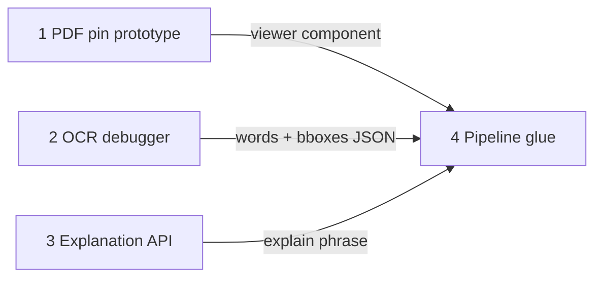

# Pinpoint mini-projects

Four standalone learning projects that build toward the Pinpoint MVP. **Complete them in order** — each one feeds the next.

| # | Project | Folder (suggested) | Plan |
|---|---------|-------------------|------|
| 1 | PDF pin prototype | `mini-projects/01-pdf-pin-prototype/` | [01-pdf-pin-prototype.md](./01-pdf-pin-prototype.md) |
| 2 | OCR debugger | `mini-projects/02-ocr-debugger/` | [02-ocr-debugger.md](./02-ocr-debugger.md) |
| 3 | Explanation API | `mini-projects/03-explanation-api/` | [03-explanation-api.md](./03-explanation-api.md) |
| 4 | Pipeline glue | `mini-projects/04-pipeline-glue/` | [04-pipeline-glue.md](./04-pipeline-glue.md) |

## How to use these in separate Cursor chats

Open a **new chat** for each project and paste the starter prompt from that project's plan (under **Chat starter**). Attach or `@`-reference the plan file so the agent has full context.

Example for project 1:

```
@docs/mini-projects/01-pdf-pin-prototype.md

Implement this mini-project in mini-projects/01-pdf-pin-prototype/.
Follow the plan step by step. Stop when the success criteria are met.
```

## How they connect



## Suggested timeline

| Week | Project |
|------|---------|
| 1 | PDF pin prototype |
| 2 | OCR debugger |
| 3 | Explanation API |
| 4 | Pipeline glue |

## After all four

Continue with production stack: PostgreSQL, S3, auth, and improved term detection. Each mini-project's code can live under `mini-projects/` until you're ready to merge into the main app.
