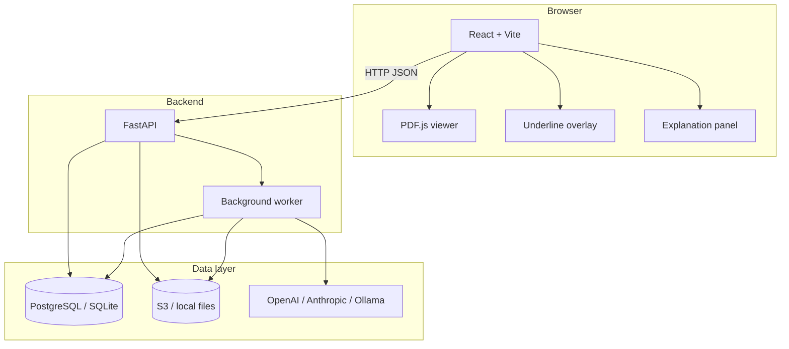
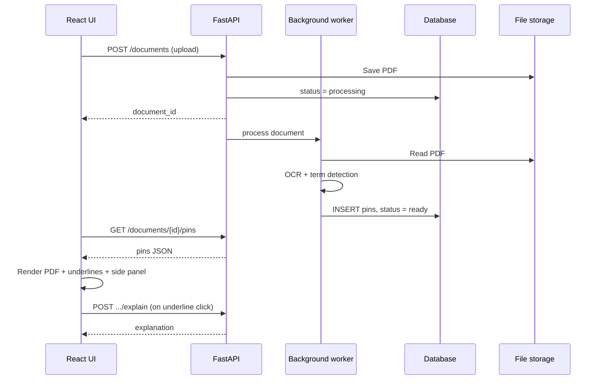

# Pinpoint — Technical overview

Implementation details for developers building Pinpoint. For product vision, features, and user-facing documentation, see the [README](../README.md).

---

## Architecture



The browser never talks to the database, file storage, or LLM directly. All secrets and processing stay on the server. The frontend calls a small REST API; a background worker handles the slow path (OCR, term detection, explanation generation).

### End-to-end flow



---

## Core concepts

### Pins

A **pin** is the data record for one marked occurrence of a term — not an on-page icon. The page shows an **underline**; explanations open in a **side panel**.

Each pin stores:

- **Page number** and **coordinates** in unscaled PDF space (so zoom never drifts the underline off its target)
- **Text** — the term or phrase being explained
- **Bounding box** — where the term was found during extraction; the underline is drawn along this box
- **Explanation** — generated on demand (or cached after first request)

Pin identity is per **occurrence**, not per word. `indemnify` on page 1 and `indemnify` on page 8 are two pins: different boxes, different surrounding text, different explanations.

Pin positions are stored in **unscaled page coordinates** (scale = 1). When the viewport scale changes, multiply by the current scale at render time only.

```ts
type Pin = {
  id: string;
  page: number;
  x: number;   // PDF user space, scale = 1
  y: number;
  text: string;
  bbox: { x: number; y: number; width: number; height: number };
  explanation?: string;
};
```

### Underlines

The overlay draws a clickable underline from `pin.bbox` (along the bottom of the box, with a hit target large enough to tap). There is no pin icon.

- **Click or tap** opens or updates the explanation panel. This is the only way to load an explanation.
- **Hover** may restyle the underline (weight, color). Hover does not open the panel and does not call `/explain`.
- Underlines stay in the page overlay so they scroll and zoom with the PDF. Explanations do not: they live in the side panel, so they are not clipped by page edges and do not need to follow the pointer.
- Cap the number of underlines per page so the overlay stays usable.

On a phone, the same click path applies (tap). There is no hover-only interaction.

### Explanation panel

The panel is a session log of pins the user has opened, not a chatbot and not a glossary of every pin in the document. It stays empty until the first underline click. Closing the panel must not discard that session history for the document.

Layout, top to bottom:

1. **Current card** — the pin last clicked on the page. Always expanded. This is a separate slot, not a row in the stack. Size it to its content with a **max height**; if the explanation is long, the card scrolls internally so it cannot eat the stack.
2. **Stack** — every previously opened pin, **newest at the top** (the card that just left current sits first). Older lookups are further down. The stack is its own scrolling region and fills the remaining panel height.

On a phone, use a bottom sheet with the same two zones: current on top, stack under it.

Cards are **unique by `pin.id`**. Stack rows show the term, page number, and a short surrounding snippet when the same word appears more than once so two `indemnify` rows stay distinct.

A new card may appear immediately in a loading state, then fill when `/explain` returns (or from cache).

### Panel interaction rules

These rules cover the edge cases for current vs stack, duplicates, and scrolling.

**Page click (underline on the PDF)**

- That pin becomes the current card. Fetch or show its explanation.
- If another pin was current, it **collapses** and is **inserted at the top of the stack**.
- If this pin is already in the stack (the user clicked the same underline again), **do not add a duplicate**. Pull that row out of the stack into the current slot (move-to-latest).
- If this pin was already current, leave it current; do not copy it into the stack.
- After inserting onto the stack, keep the stack **scrolled to the top** so the newly collapsed row is visible. Do not use overflow anchoring (or similar) to keep an older expanded card in view — that would hide the newest stack rows.
- Optionally highlight the active underline on the page.

**Same word, different place**

- A new occurrence is a new `pin.id`. Treat it as a new current card. The earlier occurrence stays as its own stack row. Do not merge by term text; explanations are tied to local context.

**Stack click**

- Clicking a stack row **expands or collapses that row in place**. It does **not** replace the current card, so the user can read current and an older explanation together.
- Expanding a stack row does **not** reorder the stack.
- Optionally scroll the PDF to that pin’s underline and highlight it. Do not change which card is current.

**Collapse vs stay expanded**

- **Collapse on leave only.** Auto-collapse happens only when a card leaves the current slot (a new page-click displaced it).
- If the user then expands that row in the stack, it **stays expanded while it remains in the stack**. Later page-clicks prepend new collapsed rows at the top; they must not auto-collapse this row.
- If that pin becomes current again and later leaves current, **collapse on leave still applies**. The earlier manual expand is not remembered across a return to current. The user can expand it again from the stack.
- There is no third “compare” pane. Seeing more than one explanation means: current (always open) plus any stack rows the user has expanded.

**Stack scrolling**

- The stack is an independent `overflow-y` region. The current card does not scroll with it.
- “Stay expanded” means the card is still open when the user finds it, not that it stays on screen.
- As new terms are opened, prepended rows crowd the top of the stack. An expanded older card **may scroll out of view**. It remains expanded; scrolling down reveals it.
- Do not pin expanded rows to the stack viewport, and do not auto-scroll the stack to follow them.

**What not to build**

- Pin icons on the page
- Hover-only popups or a connected overlay bubble on the PDF
- Duplicate cards for the same `pin.id`
- Reordering the stack when a row is expanded
- A third panel region for “open” or “compare” cards
- Treating the stack as a full glossary of detected-but-not-opened pins

### Document processing

Pinpoint handles two kinds of input:

| Type                    | Example                         | Approach                                                        |
| ----------------------- | ------------------------------- | --------------------------------------------------------------- |
| **Digital PDF**         | Text-selectable contract or paper | Extract words and bounding boxes directly (PyMuPDF, pdfplumber) |
| **Scanned PDF / image** | Photo of a printed form         | OCR with Tesseract, then bounding boxes from OCR output         |

Real-world documents vary widely — multi-column layouts, dense forms, low-quality scans. Robust extraction is a first-class engineering concern.

Extraction output schema:

```json
{
  "source": "document.pdf",
  "pages": [
    {
      "page": 1,
      "width": 612,
      "height": 792,
      "words": [
        {
          "text": "indemnify",
          "bbox": { "x": 120.5, "y": 340.2, "width": 28.0, "height": 12.0 },
          "confidence": 95
        }
      ]
    }
  ]
}
```

### Explanations

The explanation service takes three inputs:

- `phrase` — the term to explain (e.g. `"indemnify"`)
- `context` — a paragraph of surrounding text from the document
- `document_type` — inferred or user-supplied (e.g. `lease`, `lab_report`, `research_paper`, `policy`)

The model is prompted to stay grounded in the provided context, write in plain English, and flag when context is insufficient. Document type matters: the same word can mean different things in a lease, a medical record, and a research paper.

**System prompt rules:**

- Plain English for a general reader, not a domain expert
- Use only provided context; do not invent facts, figures, or citations
- Explain what the term means **and** how it applies in this document
- 2–4 short sentences
- No legal, medical, financial, or other professional advice
- If context is insufficient, say what is missing

---

## Data model

### SQLite (prototype)

```sql
CREATE TABLE documents (
  id TEXT PRIMARY KEY,
  filename TEXT,
  status TEXT,  -- processing | ready | failed
  storage_path TEXT,
  created_at TEXT
);

CREATE TABLE pins (
  id TEXT PRIMARY KEY,
  document_id TEXT,
  page INTEGER,
  text TEXT,
  bbox_json TEXT,
  x REAL,
  y REAL,
  is_visible INTEGER DEFAULT 1,
  explanation TEXT,
  FOREIGN KEY (document_id) REFERENCES documents(id)
);
```

### Production upgrades

| Concern        | Prototype                  | Production                    |
| -------------- | -------------------------- | ----------------------------- |
| Database       | SQLite                     | PostgreSQL                    |
| File storage   | Local `data/uploads/`      | S3 (pre-signed uploads)       |
| Auth           | None                       | Clerk or Supabase             |
| Job queue      | `BackgroundTasks` / thread | Redis-backed worker           |
| Term detection | Heuristic + LLM pass       | LLM pass over extracted text  |
| Explanations   | On-demand                  | Cached after first generation |

---

## API

### Endpoints (MVP)

```
POST   /documents                              multipart upload → { id, status }
GET    /documents                              list
GET    /documents/{id}                         metadata + status
GET    /documents/{id}/pins                    pin array when ready
GET    /documents/{id}/file                    serve PDF for PDF.js
POST   /documents/{id}/pins/{pin_id}/explain   on-demand explanation (page click → current card)
```

### Explanation endpoint

```
POST /explain
Body: { "phrase", "context", "document_type" }
Response: { "explanation" }
```

### Term detection (v1)

Pinpoint does not rely on a fixed domain dictionary. Documents can come from any field, so term detection must work without knowing the domain in advance.

v1 approach:

1. Extract words and bounding boxes from the PDF (or OCR output).
2. Score candidate phrases (abbreviations, uncommon words, multi-word technical terms) using heuristics plus an LLM pass over the extracted text.
3. Create pins for the highest-scoring terms and underline them, with a cap per page so the overlay stays usable.

LLM-based detection is the intended default once the pipeline is in place. A heuristic-only pass can stand in during early development.

---

## Tech stack

| Layer          | Tools                                                  |
| -------------- | ------------------------------------------------------ |
| **Frontend**   | React, Vite, TypeScript, PDF.js (`pdfjs-dist`)         |
| **Backend**    | FastAPI (Python)                                       |
| **Extraction** | PyMuPDF, pdfplumber, Tesseract (`pytesseract`), Pillow |
| **LLM**        | OpenAI, Anthropic, or Ollama (local)                   |
| **Database**   | SQLite (prototype) → PostgreSQL + Prisma or SQLAlchemy |
| **Storage**    | Local files (prototype) → S3                           |
| **Auth**       | Clerk or Supabase (production)                         |

### Pinpoint-specific pipeline tools

| Tool                          | Role                                    | Language |
| ----------------------------- | --------------------------------------- | -------- |
| **pdfjs-dist**                | Render PDF in browser                   | JS       |
| **PyMuPDF** (`fitz`)          | Extract text + bboxes from digital PDFs | Python   |
| **pdfplumber**                | Alternative text extraction             | Python   |
| **Tesseract** (`pytesseract`) | OCR for scanned pages                   | Python   |
| **Pillow (PIL)**              | Draw debug boxes on page images         | Python   |
| **OpenAI / Anthropic SDK**    | Plain-English explanations              | Python   |

For syntax, secrets handling, async patterns, and when to pick alternatives, see **[full-stack-frameworks-guide.md](./full-stack-frameworks-guide.md)**.

---

## Development path

Pinpoint is built in phases. Each phase produces working software before adding complexity.

### Phase 1 — Foundation (current)

Stand up the core product as a single app: upload any PDF, extract text and bounding boxes, detect confusing terms, underline them, and explain them in the side panel.

- React + Vite viewer with PDF.js, an underline overlay, and an explanation side panel
- FastAPI upload and document APIs
- Extraction worker (digital PDF + OCR fallback)
- Term detection that is domain-agnostic
- Grounded explanation endpoint
- SQLite + local file storage

### Phase 2 — Production MVP

- SQLite → PostgreSQL; local files → S3
- Pre-signed uploads; auth (Clerk / Supabase)
- Improved term detection (LLM pass over extracted text)
- Explanation caching; underline visibility toggle

### Phase 3 — Beyond MVP

- RAG-based open-ended document Q&A
- Improved multi-word phrase detection
- Additional file types beyond PDF

---

## Getting started

1. Clone this repository.
2. Read this overview and the [README](../README.md) for product and architecture context.
3. Implement Phase 1 as a single full-stack app (viewer, API, extraction worker, explanations).

There is no application code in the repo yet. The repository is documentation-first until the foundation is implemented.

---

## Repository structure

```
Pinpoint/
├── README.md                          # Product vision, features, and user guide
├── docs/
│   ├── technical-overview.md          # This file
│   └── full-stack-frameworks-guide.md # Tool reference for building Pinpoint
└── LICENSE                            # GPL-3.0
```

---

## Further reading

- [README](../README.md) — product vision and user guide
- [Full-stack frameworks guide](./full-stack-frameworks-guide.md) — tool reference
